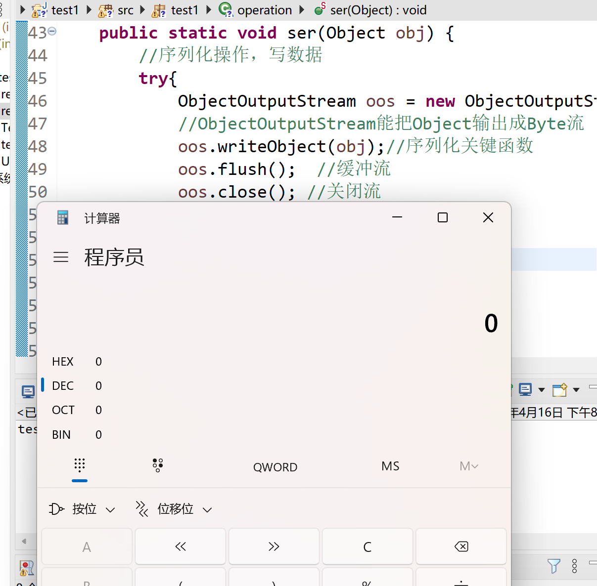

## Java反射

反射性质个人理解就是透明化实例对象，即在运行状态的时候，对于某个类，可以动态获取到这个类的属性和函数，且能调用它的相关属性和函数(私有)

1. 运行时加载完全未知的类
2. 动态加载一个只有名称的类，对于任意加载的类都可以知道这个类的属性和方法
3. 加载完类后，堆产生一个class类型的对象，包含了完成的类信息，类似一个镜子，因此叫做反射

反射的立足点在于字节码文件对象class，通过class获取想要的信息，获取字节码文件对象的三种方式：

```java
Class c1 = Class.forName("类名"); //最常用
Class c2 = Person.class; //最安全和性能最好的方法
//Person变成Class，通过类获取
Class c3 = p.getClass();
//通过实例获取类
```

```java
package test1;

public class User {
    private String name;
    private int age;
    public User(){}
    public User(String name,int age){
        this.name = name;
        this.age = age;
    }
    public String getName() {
		return name;
	}
	public void setName(String name) {
		this.name = name;
	}
	public int getAge() {
		return age;
	}
	public void setAge(int age) {
		this.age = age;
	}
	public void test(){
        System.out.println(this.age + this.name);
    }
}
```

```java
public static void methodinfo(Object obj) {
	Class a = obj.getClass();
	Method[] m = a.getMethods();
	for(int i = 0; i < m.length; i++) {
		Class returntype = m[i].getReturnType();
		System.out.println(returntype.getName() + " " + m[i].getName());
		Class []paramtype = m[i].getParameterTypes();
		for(Class class1: paramtype) {
			System.out.println(class1.getName());
		}
	}
}
public static void main(String[] args) {
		User temp_user = new User("18", 20);
		//methodinfo(temp_user);
}
```

反射获取类的一些常见函数

1. Method getMethod(String name)
2. []Method getMethods()
3. Method getDeclaredMethod(String name) 获得该类自己声明的某个名字的方法
4. []Method getDeclaredMethods() 获得该类自己声明的无视私有的全部方法

```java
public class test2 {
    public static void printfield(Object obj) {
        Class a = obj.getClass();
        Field[] f = a.getFields();
        for (Field field: f){
            // 字段类型的名称
            Class ftype = field.getType();
            String typename = ftype.getName();
            // 字段名称
            String fieldname = field.getName();
            System.out.println(typename + fieldname);
        }
    }
    public static void main(String[] args) {
        User user = new User("18", 20);
        printfield(user);
    }
}
```
```java
public static Object t1(Object obj) {
	Class a = obj.getClass();
	try{
		Field age_f = a.getDeclaredField("age");
		Object o = a.newInstance();
		age_f.setAccessible(true);
		age_f.set(o, 100);
		return o;
	}catch(Exception e){
		e.printStackTrace();
	}
	return a;
}
```

Field类封装了成员变量的相关操作

1. getFields() public变量
2. getDeclaredFields() 全部变量

Constructor封装构造函数

1. getConstructor() 返回一个Constructor公共构造方法对象
2. getConstructors() 返回所有构造方法
3. getDeclaredConstructor() 返回一个Constructor对象，该对象反映此Class对象所表示的类或接口的指定构造方法
4. getDeclaredConstructors() 返回一个Constructor数组，反应此类声明的所有构造方法，包括所有类型

### 尝试反射方法弹计算器

```java
package test1;

import java.lang.reflect.Method;

public class reflection1 {
    public static void main(String[] args) {
        try{
            //实例对象的getclass方法
            User testobj = new User("zzj", 20);
            Class m1 = testobj.getClass();
            //类的.class属性，类似getattr
            Class m2 = User.class;
            //运用Class.forName动态加载类
            Class m3 = Class.forName("test1.User");

            Method[] ms = m1.getMethods();

            for(Method method: ms){
                if(method.getName().equals("getName")){
                    Class[] paramtype = method.getParameterTypes();//获得方法的参数
                    Class returntype = method.getReturnType();//获得方法的返回类型
                    try{
                        User user = (User)m1.newInstance();
                        Object x = method.invoke(user);
                        System.out.println(x);
                    }catch(Exception e){
                        e.printStackTrace();
                    }
                }
            }
            Method method = m1.getMethod("setName", String.class);
            User user1 = (User)m1.getConstructor(String.class, int.class).newInstance("whw",20);
            //调用自定义构造器的方法
            Object x = method.invoke(user1, "whw");
            System.out.println(user1.getName());
        }catch(Exception e1){
            e1.printStackTrace();
        }
    }
}
```

通过重写readObject方法执行代码

```java
package test1;

import java.io.File;
import java.io.FileInputStream;
import java.io.FileNotFoundException;
import java.io.FileOutputStream;
import java.io.IOException;
import java.io.ObjectInputStream;
import java.io.ObjectOutputStream;
import java.io.Serializable;
import java.lang.reflect.Method;

public class reflection2 implements Serializable{
    private int age;
    private String name;
    public reflection2() {
    	
    }
    public reflection2(String name, int age) {
    	this.age = age;
    	this.name = name;
    }
    private void readObject(java.io.ObjectInputStream in) throws IOException,ClassNotFoundException{
        in.defaultReadObject();//调用原始的readOject方法

        try {//通过反射方法执行命令；
        Method method= java.lang.Runtime.class.getMethod("exec", String.class);
        Object result = method.invoke(Runtime.getRuntime(), "calc.exe");    
        }
        catch(Exception e) {
            e.printStackTrace();
        }
    }

    public static void main(String[] args){
        reflection2 x= new reflection2();
        operation.ser(x);
        operation.deser();
    }
}

class operation {
    public static void ser(Object obj) {
        //序列化操作，写数据
        try{
            ObjectOutputStream oos = new ObjectOutputStream(new FileOutputStream("object.obj"));
            //ObjectOutputStream能把Object输出成Byte流
            oos.writeObject(obj);//序列化关键函数
            oos.flush();  //缓冲流 
            oos.close(); //关闭流
        } catch (FileNotFoundException e) 
        {        
            e.printStackTrace();
        } catch (IOException e) 
        {
            e.printStackTrace();
        }
    }

    public static void deser() {
        //反序列化操作，读取数据
        try {
            File file = new File("object.obj");
            ObjectInputStream ois= new ObjectInputStream(new FileInputStream(file));
            Object x = ois.readObject();//反序列化的关键函数
            System.out.print(x);
            ois.close();
        } catch (FileNotFoundException e) {
            e.printStackTrace();
        } catch (Exception e) {
            e.printStackTrace();
        }
    }
}
```



### 总结

反射和Java反序列化本质上属于控制输入、数据和变量，利用代码中已经存在的函数和逻辑，通过改变内容来控制不同的逻辑流程，如果想要实现反序列化类至少要满足两步：

1. 可序列化的类，重写了类似readObject方法，除了默认的对象读取外，至少要保证有其它的处理逻辑
2. 重写的readObject方法逻辑中存在method.invoke函数，直接或间接使用了类似的调用任意方法的函数，且参数可控

```
Apache Commons Colletions <= 3.2.1 Gadget构造过程
Gadget chain:
	ObjectInputStream.readObject()
		AnnotationInvocationHandler.readObject()
			AbstractInputCheckedMapDecorator$MapEntry.setValue()
				TransformedMap.checkSetValue()
                    ConstantTransformer.transform()
                    InvokerTransformer.transform()
                        Method.invoke()
                            Class.getMethod()
                    InvokerTransformer.transform()
                        Method.invoke()
                            Runtime.getRuntime()
                    InvokerTransformer.transform()
                        Method.invoke()
                            Runtime.exec()
```

