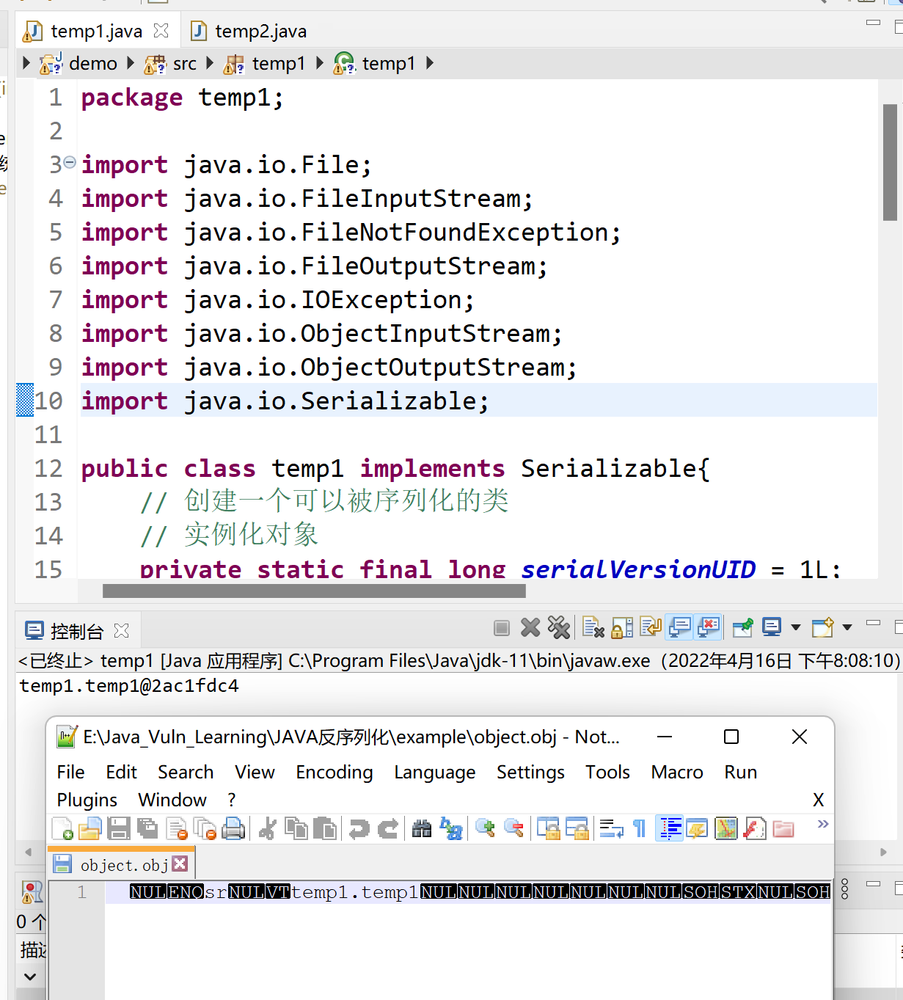
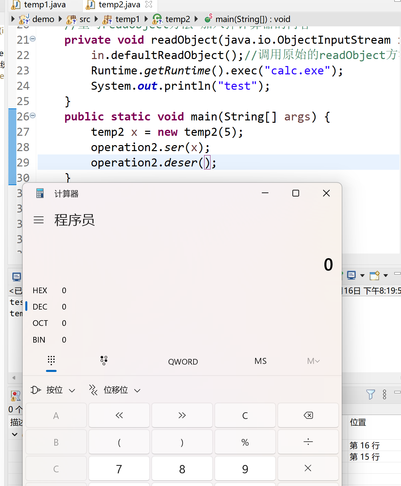

## Java 反序列化
### 基本知识
1. 概念
   和PHP反序列化一致，都是通过serialize()以及相关函数把Java对象保存为二进制字节码的过程，反序列化是它的逆过程
   
2. 应用
   1. 内存对象数据保存在文件中
   2. 网络传输数据
   3. RMI传输对象
   
3. 注意点
   1. 父类存在可序列化的接口，则对应字段处理相同
   2. 父类没有实现可序列化接口，则父类的字段不会序列化，反序列化会调用父类的默认构造函数
   3. static类型无法序列化
   
4. demo
   实现序列化和反序列化的基本操作demo
   
   ```java
   package temp1;
   
   import java.io.File;
   import java.io.FileInputStream;
   import java.io.FileNotFoundException;
   import java.io.FileOutputStream;
   import java.io.IOException;
   import java.io.ObjectInputStream;
   import java.io.ObjectOutputStream;
   import java.io.Serializable;
   
   public class temp1 implements Serializable{
       // 创建一个可以被序列化的类
       // 实例化对象
       private static final long serialVersionUID = 1L;
       private int n;
       // 构造函数
       public temp1(int n){
           this.n = n;
       }
       public static void main(String[] args) {
           temp1 x = new temp1(5);//实例化一个对象
           operation.ser(x);//序列化
           operation.deser();//反序列化
       }
   }
   
   class operation{
       public static void ser(Object obj) {
           //序列化 写操作
           try{
               ObjectOutputStream oos = new ObjectOutputStream(new FileOutputStream("object.obj"));
               //ObjectOutputStream把Obj输出成Byte
               oos.writeObject(obj);//序列化关键函数 写
               oos.flush();//缓冲流
               oos.close();//关闭流
           }catch(FileNotFoundException e){
               e.printStackTrace();
           }catch(IOException e){
               e.printStackTrace();
           }
       }
       public static void deser() {
           //反序列化 读操作
           try{
               File file = new File("object.obj");
               ObjectInputStream ois = new ObjectInputStream(new FileInputStream(file));
               Object x = ois.readObject();//反序列化关键函数 读
               System.out.print(x);
               ois.close();
           }catch(FileNotFoundException e){
               e.printStackTrace();
           }catch(Exception e){
               e.printStackTrace();
           }
       }
   }
   ```
   
   
   
   ```java
   package temp1;
   
   import java.io.File;
   import java.io.FileInputStream;
   import java.io.FileNotFoundException;
   import java.io.FileOutputStream;
   import java.io.IOException;
   import java.io.ObjectInputStream;
   import java.io.ObjectOutputStream;
   import java.io.Serializable;
   
   public class temp2 implements Serializable{
   	// 创建可被序列化的类 重写readObject方法
   	private static final long serialVersionUID = 1L;
       private int n;
       // 构造函数
       public temp2(int n){
           this.n = n;
       }
       //重写readObject方法 加入弹计算器的内容
       private void readObject(java.io.ObjectInputStream in) throws IOException, ClassNotFoundException {
       	in.defaultReadObject();//调用原始的readObject方法
       	Runtime.getRuntime().exec("calc.exe");
       	System.out.println("test");
   	}
       public static void main(String[] args) {
   		temp2 x = new temp2(5);
   		operation2.ser(x);
   		operation2.deser();
   	}
   }
   
   class operation2{
       public static void ser(Object obj) {
           //序列化 写操作
           try{
               ObjectOutputStream oos = new ObjectOutputStream(new FileOutputStream("object.obj"));
               //ObjectOutputStream把Obj输出成Byte
               oos.writeObject(obj);//序列化关键函数 写
               oos.flush();//缓冲流
               oos.close();//关闭流
           }catch(FileNotFoundException e){
               e.printStackTrace();
           }catch(IOException e){
               e.printStackTrace();
           }
       }
       public static void deser() {
           //反序列化 读操作
           try{
               File file = new File("object.obj");
               ObjectInputStream ois = new ObjectInputStream(new FileInputStream(file));
               Object x = ois.readObject();//反序列化关键函数 读
               System.out.print(x);
               ois.close();
           }catch(FileNotFoundException e){
               e.printStackTrace();
           }catch(Exception e){
               e.printStackTrace();
           }
       }
   }
   ```
   
   

