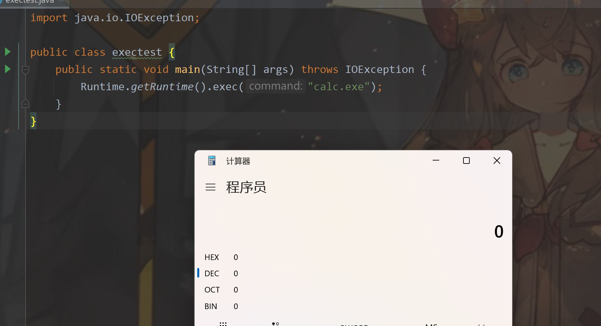
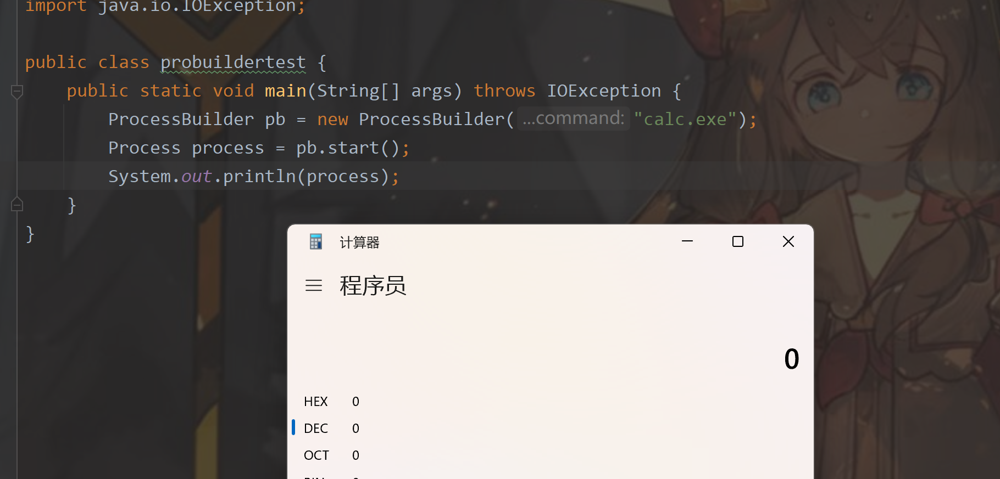
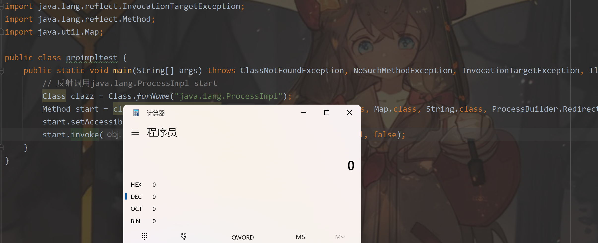

## JAVA常用命令执行

### 常见系统属性

与System.getProperty()和System.getProperties()方法搭配使用

```java
// 用户的账户名称、主目录、当前工作目录
user.name
user.home
user.dir
// 操作系统信息
os.name
os.arch
os.version
// Java信息
java.home
java.class.version //类格式版本
java.path
```

### 命令执行方式

- java.lang.Runtime
  - exec()
  
    ```java
    import java.io.IOException;
    
    public class exectest {
        public static void main(String[] args) throws IOException {
            Runtime.getRuntime().exec("calc.exe");
        }
    }
    ```
  
    
  
  - load()
  
    加载动态链接库，linux下的so文件和windows下的dll文件
  
    提前准备dll文件
  
    > msfvenom -p windows/x64/exec --platform win -a x64 CMD=calc.exe EXITFUNC=thread -f dll> calc.dll
  
    ```java
    public class loadtest {
        public static void main(String[] args) {
            Runtime rt = Runtime.getRuntime();
            rt.load("xxx.dll");
        }
    }
    ```
  
- java.lang.ProcessBuilder

  ```java
  import java.io.IOException;
  
  public class probuildertest {
      public static void main(String[] args) throws IOException {
          ProcessBuilder pb = new ProcessBuilder("calc.exe");
          Process process = pb.start();
          System.out.println(process);
      }
  }
  ```

  

- java.lang.ProcessImpl

  ```java
  import java.lang.reflect.InvocationTargetException;
  import java.lang.reflect.Method;
  import java.util.Map;
  
  public class proimpltest {
      public static void main(String[] args) throws ClassNotFoundException, NoSuchMethodException, InvocationTargetException, IllegalAccessException {
          // 反射调用java.lang.ProcessImpl start
          Class clazz = Class.forName("java.lang.ProcessImpl");
          Method start = clazz.getDeclaredMethod("start", String[].class, Map.class, String.class, ProcessBuilder.Redirect[].class, boolean.class);
          start.setAccessible(true);
          start.invoke(null, new String[]{"calc"}, null, null, null, false);
      }
  }
  ```

  

  
