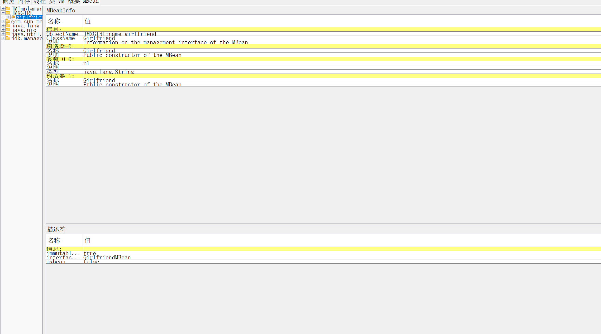
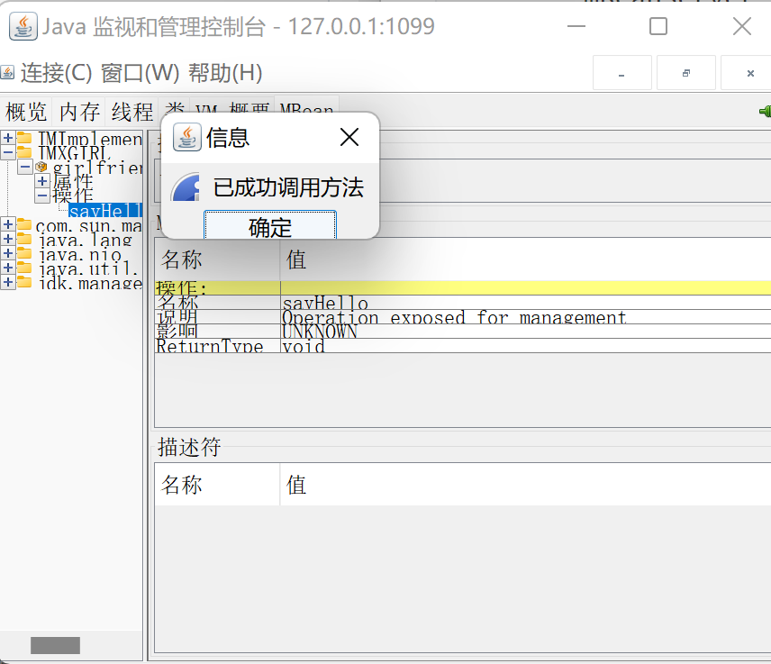

## JMX安全

### 简介

JMX(Java Management Extensions)为应用程序、系统、设备等植入管理功能的框架，简单来说就是通过JMX管理、监视java程序，能够被JMX控制的称为MBean

### MBean编写demo

每个MBean需要实现一个接口，且接口命名以MBean结尾，实现接口的命名需要去掉MBean后缀

并且将其绑定到MBeanServer上

```java
import javax.management.DynamicMBean;

public interface GirlfriendMBean {
    String name = "";
    public void setName(String name);
    public String getName();
    public void sayHello();
}
```

```java
import javax.management.DynamicMBean;
public class Girlfriend implements GirlfriendMBean{
    String name;
    public Girlfriend(String name){
        this.name = name;
    }
    public Girlfriend(){
        this.name = "My girl";
    }
    @Override
    public void setName(String name) {
        this.name = name;
    }

    @Override
    public String getName() {
        return this.name;
    }

    @Override
    public void sayHello() {
        System.out.println("hello, I'm your girlfriend");
    }
}
```

```java
import javax.management.*;
import javax.management.remote.JMXConnectorServer;
import javax.management.remote.JMXConnectorServerFactory;
import javax.management.remote.JMXServiceURL;
import java.io.IOException;
import java.lang.management.ManagementFactory;
import java.net.MalformedURLException;
import java.rmi.RemoteException;
import java.rmi.registry.LocateRegistry;
import java.rmi.registry.Registry;

public class Server {
    public static void main(String[] args) throws MalformedObjectNameException, NotCompliantMBeanException, InstanceAlreadyExistsException, MBeanRegistrationException, IOException {
        MBeanServer mBeanServer = ManagementFactory.getPlatformMBeanServer();
        System.out.println("Register bean");
        // 实例化一个MBean
        GirlfriendMBean girlfriend = new Girlfriend();
        ObjectName objectName = new ObjectName("JMXGIRL:name=girlfriend");
        // 绑定到MBeanServer
        mBeanServer.registerMBean(girlfriend, objectName);
        // 创建一个rmi registry
        Registry registry = LocateRegistry.createRegistry(1099);
        // 构造JMXServiceURL
        JMXServiceURL jmxServiceURL = new JMXServiceURL("service:jmx:rmi:///jndi/rmi://localhost:1099/jmxrmi");
        // 构造JMXConnectorServer
        JMXConnectorServer jmxConnectorServer = JMXConnectorServerFactory.newJMXConnectorServer(jmxServiceURL, null,mBeanServer);
        jmxConnectorServer.start();
        System.out.println("ready");
    }
}
```

cmd中直接输入jconsole调用java自带的工具





demo中的MBean和JMX Server位于同一主机上，还提供了其他主机上的MBean绑定到别的server上

现成的工具[mjet](https://github.com/mogwailabs/mjet)

