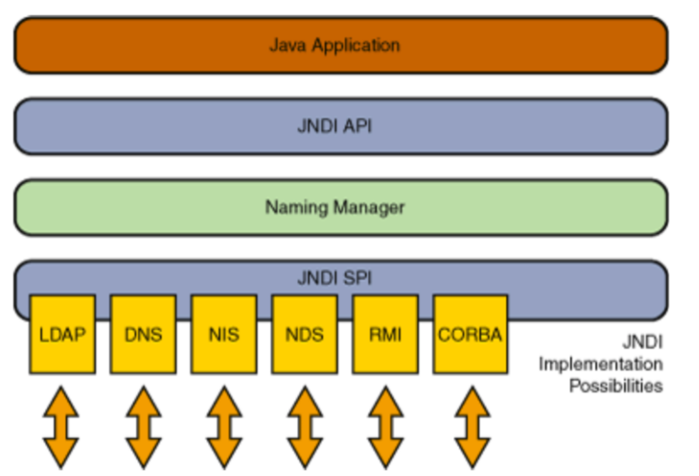
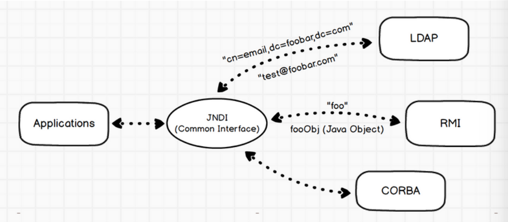

## JNDI基础

### JNDI概念

RMI就是Remote Method Invocation远程方法调用，Java Remote Method Protocol是一个Java中实现远程方法调用使用的协议

JNDI就是Java Naming and Directory Interface，本质上是一组API接口，可以操作目录服务和命名服务的接口



#### 命名服务

命名服务是一种键值对绑定，类似RMI就是典型的命名服务，通过特定的键名锁定检索键值

#### 目录服务

目录服务是命名服务的拓展服务，通过对象属性来匹配对象，比如通过年级——专业——姓名这种类似目录的形式匹配某个人的属性，与命名服务本质一样，只不过命名服务是单键值的目录服务



JNDI是对访问目录服务的逻辑再封装，其中LDAP用目录式进行匹配，JNDI传递键foo，RMI服务端反馈一个对象，LDAP传过去多个键值对

### demo

JNDI提供了绑定了查找的方法，分别是bind绑定和lookup查找

首先实现接口，并创建一个类实现这个接口

```java
import java.rmi.Remote;
import java.rmi.RemoteException;

public interface IHello extends Remote {
    public String sayHello(String name) throws RemoteException;
}

import java.rmi.RemoteException;
import java.rmi.server.UnicastRemoteObject;

public class IHelloImpl extends UnicastRemoteObject implements IHello {
    protected IHelloImpl() throws RemoteException{
        super();
    }
    @Override
    public String sayHello(String name) throws RemoteException{
        return "Hello, " + name;
    }
}
```

然后简单创建远程对象，实现绑定和调用

```java
import javax.naming.Context;
import javax.naming.InitialContext;
import java.rmi.registry.LocateRegistry;
import java.rmi.registry.Registry;
import java.util.Properties;

public class Demo {
    public static void main(String[] args) throws Exception{
        // 配置JNDI的url和端口
        Properties env = new Properties();
        env.put(Context.INITIAL_CONTEXT_FACTORY, "com.sun.jndi.rmi.registry.RegistryContextFactory");
        env.put(Context.PROVIDER_URL, "rmi://localhost:1099");

        // 创建初始环境
        Context ctx = new InitialContext(env);

        // 创建rmi映射表
        Registry registry = LocateRegistry.createRegistry(1099);

        // 创建对象
        IHello hello = new IHelloImpl();

        // 绑定对象到注册表
        registry.bind("hello", hello);

        // jndi 获取远程对象
        IHello rhello = (IHello) ctx.lookup("rmi://localhost:1099/hello");

        // 调用远程对象方法
        System.out.println(rhello.sayHello("bcyx"));
    }
}
```

简单demo将服务端和客户端写到一起了，但是整体流程相同