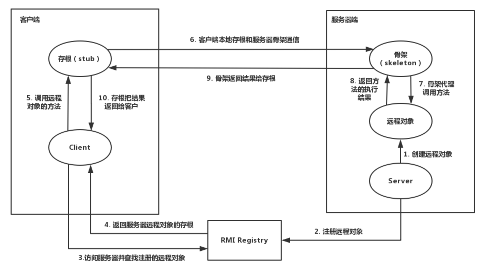
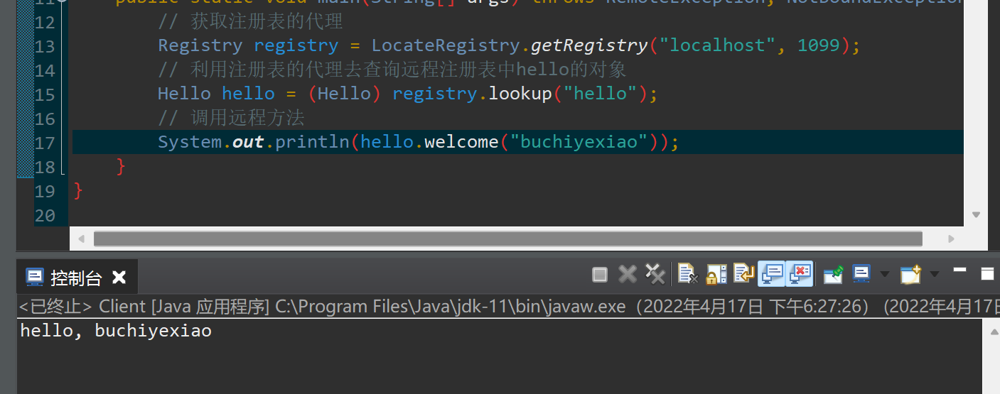

## RMI
### RMI基础知识
RMI即Remote Method Invocation，远程方法调用，方法的参数通过序列化传递，因此服务端对象提供了一个方法接收Object类型的参数，如果存在构造的pop链，则可以进行攻击

RMI中一共三个部分，分别是Client、Server和Registry(注册中心)

|  Server   |  Registry   |  Client   |
| :--: | :--: | :--: |
|  提供具体服务的远程对象   |  一个注册表，存放着远程对象的位置(IP端口标识符)   |  远程对象的使用者   |

其中server和registry可以在同一台服务器中实现，因此具体流程可以概述为：
1. registry启动，监听端口1099
2. server向registry注册远程对象
3. client从registry获得远程对象的代理，需要提供IP端口和标识符，然后Client通过代理调用远程方法，server端的代理收到调用方法，以代理执行对应方法，并把结果反馈给client

途中stub是客户端代理，skeleton是服务端代理



### 简单实现

创建接口Hello，然后实现对应类Helloimpl

```java
package model;

import java.rmi.Remote;
import java.rmi.RemoteException;

public interface Hello extends Remote{
	public String welcome(String name) throws RemoteException;
}
```
```java
package model;

import java.rmi.RemoteException;
import java.rmi.server.UnicastRemoteObject;

import model.Hello;

public class Helloimpl extends UnicastRemoteObject implements Hello{
	public Helloimpl() throws RemoteException{
		// TODO 自动生成的构造函数存根
	}
	@Override
	public String welcome(String name) throws RemoteException {
		// TODO 自动生成的方法存根
		return "hello, " + name;
	}
}
```
```java
package server;

import java.rmi.RemoteException;
import java.rmi.registry.LocateRegistry;
import java.rmi.registry.Registry;

import model.Hello;
import model.Helloimpl;

public class Server {
	public static void main(String[] args) throws RemoteException{
		// 创建对象
		Hello hello = new Helloimpl();
		// 创建注册表
		Registry registry = LocateRegistry.createRegistry(1099);
		// 绑定对象到注册表 取名为hello
		registry.rebind("hello", hello);
	}
}
```
```java
package client;

import java.rmi.NotBoundException;
import java.rmi.RemoteException;
import java.rmi.registry.LocateRegistry;
import java.rmi.registry.Registry;

import model.Hello;

public class Client {
	public static void main(String[] args) throws RemoteException, NotBoundException{
		// 获取注册表的代理
		Registry registry = LocateRegistry.getRegistry("localhost", 1099);
		// 利用注册表的代理去查询远程注册表中hello的对象
		Hello hello = (Hello) registry.lookup("hello");
		// 调用远程方法
		System.out.println(hello.welcome("buchiyexiao"));
	}
}
```

启动服务器，然后再启动客户端，客户端成功调用远程方法

（传参的时候需要保证参数是可序列化的，代码中传参为String，可序列化，如果为自定义的对象，则需要实现Serilizable接口）



### 反序列化攻击RMI

反序列化攻击RMI的前提
1. RMI服务器端提供了接受Object参数的远程方法
2. RMI服务器端存在POP利用链的jar包

如果RMI的server端注册了对象到注册表，则可能存在一些危险对象出现可控的写文件，执行命令的操作，通过远程调用这个方法外加反序列化的方式可以完成攻击

[BaRMIe](https://github.com/NickstaDB/BaRMIe)利用list()暴力破解的方式，列出远程所有注册的远程对象

RMI本质就是动态类的加载，如果当前JVM中没有某个类的定义，可以通过远程URL去下载这个类的class，如果可以控制客户端加载类的地点，可以让客户端加载恶意代码，从而完成攻击的目的，RMI动态类加载两种方式，分别是JNDI和codebase

### codebase安全问题
动态加载类从远程URL加载，通过java.rmi.server.codebase属性指定
```java
System.setProperty("java.rmi.server.codebase", "http://127.0.0.1:8000/");
// 当本地找不到com.bcyx.hello的时候则会去http://127.0.0.1:8000/com/bcyx/hello.class
// 去对应URL下载类文件
```
服务端可以指定codebase，当服务端利用代码设置codebase的时，则会加载对应的类文件，利用的前提条件为：
1. 由于Java SecurityManager的限制，默认是不允许远程加载的，如果远程加载，需要安装RMISecurityManager并且配置java.security.policy
2. 属性java.rmi.server.useCodebaseOnly的值为false，但是从JDK6u45、7u21开始，默认为true了，true将禁用自动加载远程类文件，从classpath和当前server指定的codebase加载


