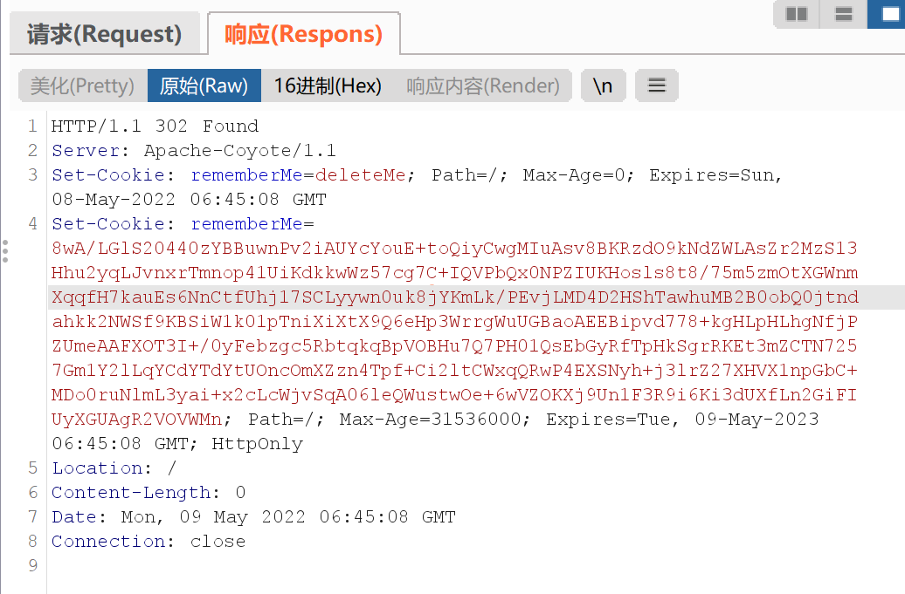
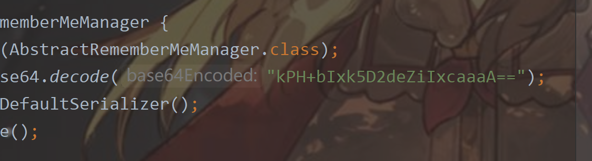

## Shiro 反序列化

### 环境配置

github上下载shiro1.2.4版本，[下载链接](https://github.com/apache/shiro/releases/tag/shiro-root-1.2.4)

打开samples\web目录项目

替换pom文件，并将版本设定为JDK1.6，如果和网上其他的更改为1.7+的话，可能会出现很多问题，很多包都需要连锁去改，比较麻烦，最后mvn生成的target的war文件拷贝到tomcat的webapp中，更改一下名字直接访问对应端口

> mvn package -D maven.skip.test=true

```
<!--  需要设置编译的版本 -->  
    <properties>
       <maven.compiler.source>1.6</maven.compiler.source>
       <maven.compiler.target>1.6</maven.compiler.target>
   </properties>
...
   <dependencies>
       <dependency>
           <groupId>javax.servlet</groupId>
           <artifactId>jstl</artifactId>
           <!--  这里需要将jstl设置为1.2 -->
           <version>1.2</version> 
           <scope>runtime</scope>
       </dependency>
.....
       <dependency>
           <groupId>org.apache.commons</groupId>
           <artifactId>commons-collections4</artifactId>
           <version>4.0</version>
       </dependency>
<dependencies>         
```

### 漏洞复现

抓到响应包存在set-cookie:rememberMe参数



remeberMe这个位置可能存在反序列化漏洞

利用ysosrial生成poc

> java -jar ysoserial.jar CommonsCollections2 "calc" > poc.txt

同时根据issue可以找到对应的AbstractRememberMeManager中密钥



乏了，这个破玩意问题好多，不想复现了，环境太难配置了，直接vulnhub


