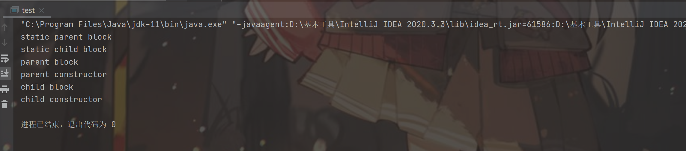

## static

static静态代码块是主动执行的，在项目执行的时候就开始初始化，静态代码块是自动执行的，区别的静态方法是被调用才执行的

### 静态方法

静态方法需要在类的前面个添加static关键字，在静态方法中只能调用同类的其它静态成员（方法和变量），不能访问非静态，应为静态在创建类的实例对象前就使用了

静态方法不能使用或引用this和super关键字，this所引用的对象没有产生，静态变量属于整个类不属于某个对象

### 类加载步骤

Java中，类装载器把一个类装入JVM中，需要三步：装载、链接和初始化，链接分为校验、准备和解析三步，除了解析，其它步骤严格顺序执行

1. 装载：查找和导入类或接口的二进制数据
2. 链接：执行下面三步
3. 检验：检查导入类或接口的二进制数据的正确性
4. 准备：给类的静态变量分配并初始化存储空间
5. 解析：符号引用转成直接引用
6. 初始化：激活类的静态变量初始化Java代码和静态Java代码块

new Child()优先执行父类的静态代码块，然后执行子类的静态代码块，然后看父类的非静态代码块和父类的构造方法，随后查看子类的非静态代码块，执行子类的构造方法。

```java
class Parent{
    static String name = "parent";
    {
        System.out.println("parent block");
    }
    static{
        System.out.println("static parent block");
    }
    public Parent(){
        System.out.println("parent constructor");
    }
}

class Child extends Parent{
    static String childname = "child";
    {
        System.out.println("child block");
    }
    static{
        System.out.println("static child block");
    }
    public Child(){
        System.out.println("child constructor");
    }
}
public class test{
    public static void main(String[] args) {
        new Child();
    }
}
```

