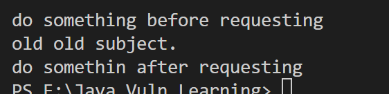
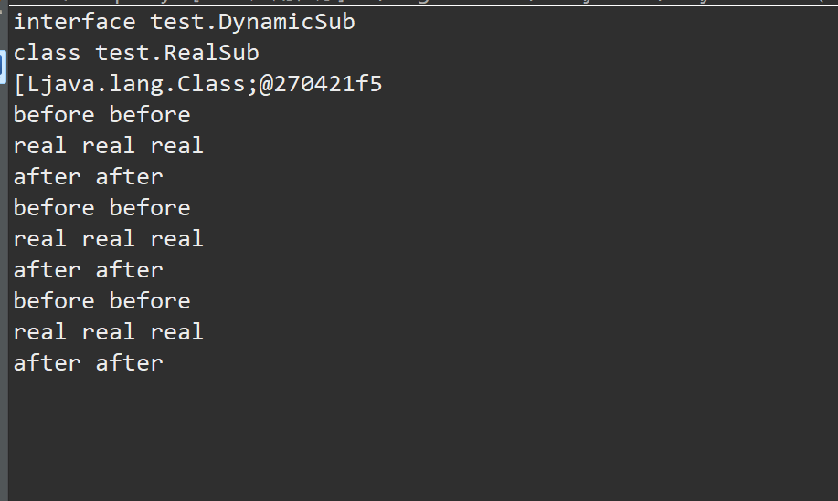

## 动态代理机制
代理的本质，为其他对象提供一种代理以便控制对这个对象的访问(所谓控制，就是可以在其掉欧阳那个行为前后分别加入一些操作)
### 静态代理

```java
package test;

public class proxy1 {
    public static void main(String[] args) {
        //Subject sub = new OldSubject(); // 老程序员的代码
        Subject sub = new NewSubject(); // new
        sub.request();
    }
}

abstract class Subject//抽象 也可以是接口interface
{
    //类比网络代理
    abstract void request();
}

//old code
class OldSubject extends Subject{
    public OldSubject(){

    }
    public void request(){
        System.out.println("old old subject.");
    }
}

class NewSubject extends Subject{//类的继承
    private OldSubject oldSubject;
    public NewSubject(){

    }
    public void request(){//
        preRequest();
        if(oldSubject == null){
            oldSubject = new OldSubject();
        }
        oldSubject.request();
        postRequest();
    }
    private void preRequest(){
        //请求前处理 打印日志 修改包
        System.out.println("do something before requesting");
    }
    private void postRequest(){
        //请求后处理
        System.out.println("do somethin after requesting");
    }
}
```



静态代理主要是添加类的继承或者接口，以便于新的环境和新的产品需求

### 动态代理 JDK动态代理

静态代理存在着一个不可避免地问题，就是当类的方法无限增多，那么新的静态代理可能需要更大的代码量，因此动态代理很重要，JDK内置的Proxy动态代理可以在运行时动态产生字节码，并不需要对每个类编写继承代理类，实现一个invocationhandler即可

有两个类和接口，分别是invocationhandler(interface)和proxy(class)

其中getProxyInstance方法：

```java
static Object    newProxyInstance(ClassLoader loader,  //指定当前目标对象使用类加载器
 Class<?>[] interfaces,    //目标对象实现的接口的类型
 InvocationHandler h      //事件处理器
) 
//返回一个指定接口的代理类实例，该接口可以将方法调用指派到指定的调用处理程序。
```

```java
package test;

import java.lang.reflect.InvocationHandler;
import java.lang.reflect.Method;
import java.lang.reflect.Proxy;

public class proxy2{
	public static void main(String[] args) {
		DynamicSub sub = new RealSub(); //动态代理sub的类型需要为接口
		Handler handler = new Handler(sub);
		/*
		 * newProxyInstance(ClassLoader loader, Class<?>[] interfaces, InvocationHandler h)
		 * ClassLoader loader 动态代理类的类加载库
		 * Class<?> interface 指定动态代理类需要实现的所有接口
		 * 指定动态代理类相关的Handler
		 */
		DynamicSub sub1 = (DynamicSub)Proxy.newProxyInstance(DynamicSub.class.getClassLoader(), new Class[] {DynamicSub.class}, handler);
		DynamicSub sub2 = (DynamicSub)Proxy.newProxyInstance(DynamicSub.class.getClassLoader(), sub.getClass().getInterfaces(), handler);
		DynamicSub sub3 = (DynamicSub)Proxy.newProxyInstance(DynamicSub.class.getClassLoader(), RealSub.class.getInterfaces(), handler);
		// 通过不同的对象使用相同的模式完成代理
		System.out.println(DynamicSub.class);
		System.out.println(sub.getClass());
		System.out.println(RealSub.class.getInterfaces());
		sub1.request();
		sub2.request();
		sub3.request();
	}
}

interface DynamicSub{
	//抽象角色 动态代理只能是接口
	abstract void request();
}

class RealSub implements DynamicSub{
	public RealSub() {
		// TODO 自动生成的构造函数存根
	}
	public void request() {
		System.out.println("real real real");
	}
}

// 动态代理处理器

class Handler implements InvocationHandler{
	private Object obj; // 被代理的对象
	/**
	 * 重写invoke方法
	 * proxy代理类 method调用方法 args调用方法的参数
	 */
	@Override
	public Object invoke(Object proxy, Method method, Object[] args) throws Throwable {
		// 接口必须实现的方法，也是逻辑的核心
		System.out.println("before before");
		Object o = method.invoke(this.obj, args);
		System.out.println("after after");
		return o;
	}
	public Handler(Object obj) {
		this.obj = obj;
	}
}
```



### 动态代理 cglib动态代理

cglib（Code Generation Lib）为第三方代码生成类库，运行时在内存动态生成一个子类对象从而实现目标对象功能的拓展，cglib不需要接口，这也是和JDK动态代理的区别，JDK至少需要实现一个接口，cglib代理无需接口

cglib重写intercept，cglib很难和反射相关，因此不过多介绍


